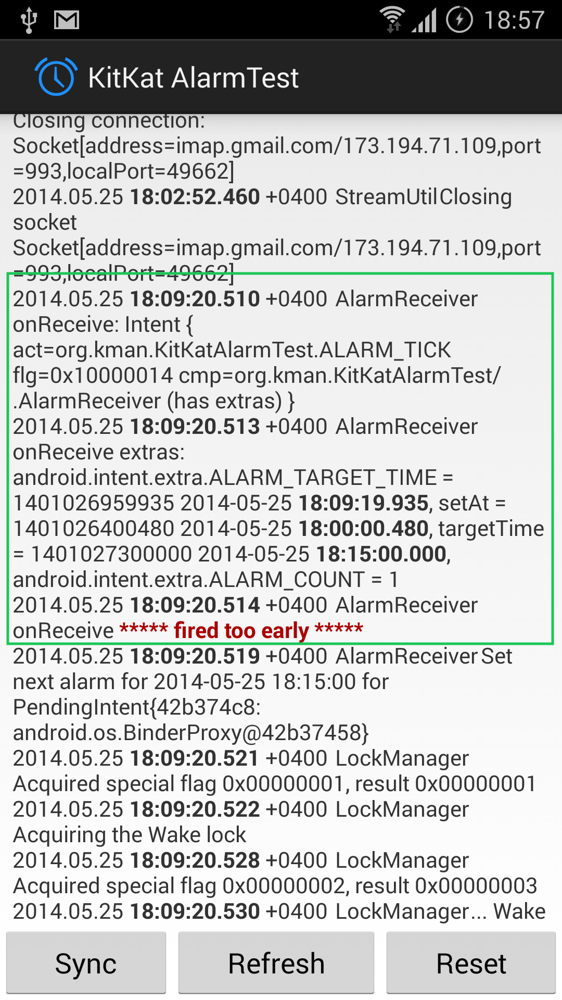

# KitKatAlarmTest

## Demonstrates an issue with AlarmManager alarms being delivered too early on Samsung devices (tested on two) for targetApi=19. 

The documentation guarantees that any of set(), setWindow(), setExact() will never deliver the alarm before
the scheduled time, only exactly on time or after.

I ran the test app on two Samsung devices with 4.4.2 that I have: a Note 3 N9005, and a Galaxy S4 i9505.

The issue happens on both of them.

In my real app, I'm seeing same issue on both Samsungs, and do not see it on a Nexus 5 or an HTC One Max, both
also with 4.4.2.

The thing that triggers the bug is connecting to a network server (and possibly leaving the opened connection
open for a time after the scheduled task completes, and closing them later). I've not tested yet if the
trigger is leaving a connection open, or establishing a network connection at all.

The relevant code is in [Task.java](KitKatAlarmTest/src/org/kman/KitKatAlarmTest/Task.java)

It builds with Eclipse and Gradle.

The issue can be easily seen in the app's log, highlighted in red:

AlarmReceiver ***** fired too early *****

Immediately above that is a dump of the alarm's extras, which includes 1) when the alarm was set and 2) for
what time it was scheduled.

